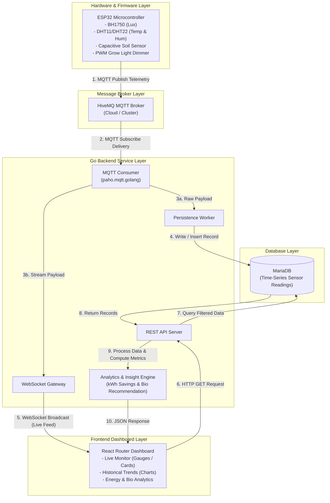

# Arsitektur & Tech Stack — Smart Grow Pot

Dokumen ini mendefinisikan tumpukan teknologi (*technology stack*), pola aliran data, spesifikasi kontrak telemetri MQTT, serta antarmuka komunikasi (REST API dan WebSocket) untuk proyek Smart Grow Pot.

---

## 1. Matriks Tech Stack per Layer

| Layer | Komponen / Perangkat Lunak | Alasan Pemilihan & Catatan Teknis |
| :--- | :--- | :--- |
| **Hardware** | **ESP32** (MCU Utama / Brain)<br>- Sensor BH1750 (Lux meter)<br>- Sensor DHT11/DHT22 (Suhu & Kelembapan Udara)<br>- Capacitive Soil Moisture Sensor v1.2 (Kelembapan Tanah)<br>- Modul Driver/MOSFET (PWM Dimmer)<br>- Modul Display LCD/OLED | ESP32 memiliki komputasi dual-core yang andal, GPIO melimpah, dan modul Wi-Fi terintegrasi. Sensor BH1750 memberikan pembacaan lux digital akurat via I2C, DHT11/DHT22 stabil untuk pembacaan mikroklimat sekitar, dan sensor tanah kapasitif tahan korosi dibandingkan sensor resistif. |
| **Firmware** | **C++ / Arduino IDE** | Ekosistem pustaka sensor yang matang dan kemudahan implementasi algoritma rule-based: *Adaptive Lighting Logic* (regulasi PWM LED) dan *Biological Threshold Evaluation* (evaluasi ambang status tanah/udara). |
| **Connectivity** | **MQTT via HiveMQ** | Protokol MQTT berkarakteristik *lightweight* dan hemat *bandwidth* untuk pengiriman data periodik/event-driven dari ESP32. HiveMQ dipilih sebagai broker yang andal dengan dukungan koneksi TLS/SSL serta performa throughput tinggi. |
| **Backend** | **Go (Golang)**<br>- Library: `paho.mqtt.golang`<br>- HTTP & WebSocket router standard/Gorilla | Go menawarkan konkurensi tingkat tinggi yang sangat efisien melalui model *goroutine* dan *channels*. Hal ini krusial untuk menangani koneksi *MQTT consumer* yang terus terbuka secara bersamaan (*concurrent*) dengan ratusan atau ribuan koneksi *WebSocket client* tanpa overhead thread yang besar serta footprint memori yang minim. |
| **Database** | **MariaDB** | Database relasional yang matang, mudah dipersiapkan, dan andal untuk menyimpan skema data time-series sederhana pada tahap awal pengembangan.<br><br>**Catatan**: Pilihan MariaDB saat ini bersifat sementara (*temporary choice*).<br>`TODO: Lakukan evaluasi performa dan migrasi ke database khusus time-series (seperti TimescaleDB atau InfluxDB) apabila frekuensi ingest dan volume data historis telah melampaui batas efisiensi indeks MariaDB.` |
| **Frontend / Dashboard** | **React Router** | Menyediakan kapabilitas *data fetching* modern, navigasi klien yang responsif (*Single Page Application*), dan rendering visualisasi grafik historis (mis. Recharts/Chart.js) yang terpisah rapi dengan koneksi WebSocket untuk pembaruan instan (*live feed*). |
| **Deployment / Hosting** | *Containerization (Docker)* | `TODO: Menunggu keputusan final arsitektur infrastruktur tim (Docker Compose mandiri pada VPS vs managed cloud deployment di GCP/AWS/DigitalOcean).` |

---

## 2. Diagram Alur Data Sistem (Pola 1)

Sistem mengadopsi **Pola 1 (Backend sebagai MQTT Consumer + API + WebSocket Gateway)**. Node ESP32 tidak berinteraksi langsung dengan database atau web client, melainkan seluruh komunikasi telemetri ditengahi oleh Go Backend.



---

## 3. Spesifikasi Payload MQTT (ESP32 → HiveMQ)

### 3.1 Konvensi Topik (*Topic Naming Convention*)
Topik MQTT disusun dengan struktur hierarkis untuk mendukung skalabilitas multi-perangkat:
```text
smartgrow/pot/{pot_id}/telemetry
```
- Contoh untuk unit pot pertama: `smartgrow/pot/pot-01/telemetry`
- QoS Level: **1** (*at least once delivery*)

### 3.2 Struktur JSON Payload
ESP32 mengirimkan payload serialisasi JSON terstandarisasi setiap interval tertentu (misal: tiap 5 detik atau saat ada perubahan ambang batas yang signifikan):

```json
{
  "device_id": "pot-01",
  "timestamp": 1774421526,
  "sensors": {
    "light_lux": 420.5,
    "temperature_c": 27.2,
    "humidity_pct": 65.0,
    "soil_moisture_pct": 48.0
  },
  "actuators": {
    "grow_light_dimming_pct": 35
  },
  "status": {
    "soil_condition": "Ideal",
    "lighting_mode": "Adaptive"
  }
}
```

#### Deskripsi Field:
- `device_id` *(string)*: Identifier unik dari pot tanaman.
- `timestamp` *(integer)*: Unix timestamp (detik) saat pembacaan diambil oleh ESP32 (menggunakan sinkronisasi NTP).
- `sensors.light_lux` *(float)*: Tingkat pencahayaan lingkungan dari sensor BH1750 dalam satuan lux.
- `sensors.temperature_c` *(float)*: Suhu sekitar dari DHT11/DHT22 dalam derajat Celcius.
- `sensors.humidity_pct` *(float)*: Kelembapan relatif udara dari DHT11/DHT22 dalam persen (0 - 100%).
- `sensors.soil_moisture_pct` *(float)*: Tingkat kelembapan tanah hasil kalibrasi dari Capacitive Soil Moisture Sensor (0 - 100%).
- `actuators.grow_light_dimming_pct` *(integer)*: Nilai duty cycle PWM pada lampu LED grow light (0% = mati, 100% = terang penuh).
- `status.soil_condition` *(string)*: Hasil evaluasi *Biological Threshold* lokal (`"Kering"`, `"Ideal"`, `"Terlalu Basah"`).
- `status.lighting_mode` *(string)*: Mode kerja aktuator (`"Adaptive"` atau `"Manual"`).

---

## 4. Antarmuka Komunikasi Backend (Go) ke Frontend (React Router)

### 4.1 REST API Endpoints

Semua respon REST API mengembalikan format JSON standar:

#### a. Data Telemetri Terkini
- **Endpoint**: `GET /api/readings/latest`
- **Query Params**:
  - `device_id` (opsional): filter berdasarkan ID pot (default: pot aktif pertama).
- **Contoh Respon**:
  ```json
  {
    "device_id": "pot-01",
    "timestamp": 1774421526,
    "light_lux": 420.5,
    "temperature_c": 27.2,
    "humidity_pct": 65.0,
    "soil_moisture_pct": 48.0,
    "grow_light_dimming_pct": 35,
    "soil_condition": "Ideal"
  }
  ```

#### b. Data Telemetri Historis
- **Endpoint**: `GET /api/readings`
- **Query Params**:
  - `device_id` (wajib): ID pot (mis. `pot-01`).
  - `range` (opsional): `1h`, `6h`, `24h`, `7d`, `30d` (default: `24h`).
  - `limit` (opsional): jumlah data maksimal (default: 100).
- **Contoh Respon**:
  ```json
  {
    "device_id": "pot-01",
    "range": "24h",
    "count": 2,
    "data": [
      {
        "timestamp": 1774417926,
        "light_lux": 300.0,
        "temperature_c": 26.8,
        "humidity_pct": 67.0,
        "soil_moisture_pct": 49.5,
        "grow_light_dimming_pct": 50
      },
      {
        "timestamp": 1774421526,
        "light_lux": 420.5,
        "temperature_c": 27.2,
        "humidity_pct": 65.0,
        "soil_moisture_pct": 48.0,
        "grow_light_dimming_pct": 35
      }
    ]
  }
  ```

#### c. Ringkasan Analitik & Insight
- **Endpoint**: `GET /api/analytics/summary`
- **Query Params**:
  - `device_id` (wajib): ID pot.
  - `period` (opsional): `today`, `this_week`, `this_month` (default: `today`).
- **Contoh Respon**:
  ```json
  {
    "device_id": "pot-01",
    "period": "today",
    "energy_metrics": {
      "baseline_consumption_kwh": 0.480,
      "actual_consumption_kwh": 0.285,
      "kwh_savings": 0.195,
      "energy_savings_pct": 40.6
    },
    "biological_insight": {
      "soil_health_score": 92,
      "light_adequacy_score": 96,
      "recommendations": [
        "Kelembapan tanah dalam kondisi optimal. Tidak diperlukan penyiraman dalam 12 jam ke depan.",
        "Pencahayaan alami cukup tinggi siang ini, LED dimmer berhasil memangkas konsumsi daya sebesar ~40%."
      ]
    }
  }
  ```

#### d. Health Check
- **Endpoint**: `GET /api/health`
- **Respon**: `{"status": "ok", "mqtt_connected": true, "database_connected": true}`

---

### 4.2 WebSocket Gateway

Untuk menghindari beban *polling* HTTP secara terus-menerus pada dashboard, Go Backend menyediakan WebSocket stream.

- **WebSocket URL**: `ws://{host}:{port}/ws/live`
- **Protokol Komunikasi**: JSON over WebSocket
- **Mekanisme**: Setiap kali worker MQTT Consumer menerima pesan dari HiveMQ, Go Backend mem-parsing data dan menyiarkannya (*broadcast*) secara non-blocking via goroutine ke semua client yang sedang terkoneksi.

#### Format Event WebSocket Broadcast
```json
{
  "event": "telemetry_update",
  "payload": {
    "device_id": "pot-01",
    "timestamp": 1774421526,
    "sensors": {
      "light_lux": 420.5,
      "temperature_c": 27.2,
      "humidity_pct": 65.0,
      "soil_moisture_pct": 48.0
    },
    "actuators": {
      "grow_light_dimming_pct": 35
    },
    "status": {
      "soil_condition": "Ideal",
      "lighting_mode": "Adaptive"
    }
  }
}
```
