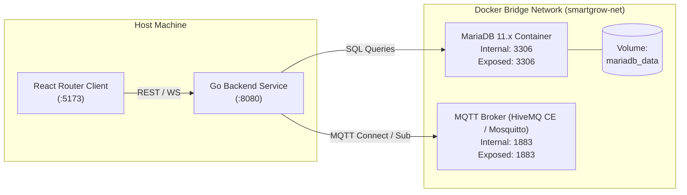

# Desain Teknis (Technical Design) — Fase 0: Project Bootstrap & Environment

Dokumen ini memuat keputusan arsitektur, struktur repositori, spesifikasi kontrak konfigurasi, topologi kontainer Docker Compose lokal, serta konfigurasi linter.

---

## 1. Struktur Repositori Monorepo

Struktur direktori dirancang untuk memisahkan backend Go, frontend React Router, dan perkakas orkestrasi lokal:

```text
mstr-smart-grow/
├── .gitignore
├── docker-compose.yml
├── .env.example
├── backend/
│   ├── cmd/
│   │   └── server/
│   │       └── main.go
│   ├── internal/
│   │   └── config/
│   │       └── config.go
│   ├── .env.example
│   ├── .golangci.yml
│   ├── go.mod
│   └── go.sum
├── frontend/
│   ├── app/
│   ├── public/
│   ├── .env.example
│   ├── .eslintrc.json
│   ├── .prettierrc
│   ├── package.json
│   ├── tsconfig.json
│   └── vite.config.ts
└── docs/
    └── specs/
```

---

## 2. Kontrak Variabel Lingkungan (*Configuration Contract*)

### 2.1 Backend (`backend/.env`)

| Variabel | Tipe Data | Nilai Default / Contoh | Wajib? | Keterangan |
| :--- | :--- | :--- | :--- | :--- |
| `APP_ENV` | `string` | `development` | Ya | `development`, `staging`, `production` |
| `PORT` | `integer` | `8080` | Ya | Port HTTP & WebSocket server |
| `HIVEMQ_BROKER_URL` | `string` | `tcp://localhost:1883` | Ya | Format: `tcp://host:port` atau `ssl://host:8883` |
| `HIVEMQ_CLIENT_ID` | `string` | `smartgrow-backend-dev` | Ya | Client ID unik untuk MQTT |
| `HIVEMQ_USERNAME` | `string` | *(kosong jika lokal)* | Tidak | Kredensial autentikasi broker |
| `HIVEMQ_PASSWORD` | `string` | *(kosong jika lokal)* | Tidak | Kredensial autentikasi broker |
| `HIVEMQ_TOPIC` | `string` | `smartgrow/+/telemetry` | Ya | Pola topik langganan MQTT wildcard |
| `MARIADB_HOST` | `string` | `localhost` | Ya | Host server MariaDB |
| `MARIADB_PORT` | `integer` | `3306` | Ya | Port server MariaDB |
| `MARIADB_USER` | `string` | `smartgrow_user` | Ya | Username database |
| `MARIADB_PASSWORD` | `string` | `smartgrow_pass` | Ya | Password database |
| `MARIADB_DATABASE` | `string` | `smartgrow_db` | Ya | Nama skema database |

### 2.2 Frontend (`frontend/.env`)

| Variabel | Tipe Data | Nilai Default / Contoh | Wajib? | Keterangan |
| :--- | :--- | :--- | :--- | :--- |
| `VITE_API_BASE_URL` | `string` | `http://localhost:8080/api` | Ya | Base URL untuk REST API backend |
| `VITE_WS_URL` | `string` | `ws://localhost:8080/ws/live` | Ya | WebSocket endpoint untuk telemetri live |

---

## 3. Topologi Lingkungan Lokal (Docker Compose)

Untuk pengujian lokal terpadu, `docker-compose.yml` menyediakan MariaDB dan broker MQTT lokal:



### Konfigurasi Service Docker Compose:
- **`mariadb`**: Image `mariadb:11.4`, *healthcheck* menggunakan `mariadb-admin ping -h localhost`, *persistent volume* `mariadb_data`.
- **`mqtt-broker`**: Image `hivemq/hivemq-ce:latest` atau `eclipse-mosquitto:2` untuk broker lokal ringan pada port 1883.

---

## 4. Konfigurasi Linter & Tooling

1. **Backend Go**:
   - Pustaka config: `github.com/caarlos0/env/v11` atau standard library parser dengan fallback.
   - Pustaka linter: `.golangci.yml` mengaktifkan `errcheck`, `gosimple`, `govet`, `ineffassign`, `staticcheck`, dan `unused`.
2. **Frontend React Router**:
   - Pustaka bundler: Vite 5+ / React Router v7.
   - ESLint: `@typescript-eslint/recommended`, `eslint-plugin-react-hooks`.
   - Prettier: `semi: true`, `singleQuote: true`, `trailingComma: "es5"`.

---

## 5. Trade-Offs & Keputusan Desain

1. **Monorepo vs Multi-repo**:
   - *Keputusan*: Monorepo tunggal dipilih karena mempermudah koordinasi perubahan kontrak antara API backend dan dashboard frontend serta menyederhanakan konfigurasi CI/CD.
2. **HiveMQ Cloud vs Broker Lokal**:
   - *Keputusan*: Mendukung skema ganda. Lingkungan default lokal menggunakan broker container (`tcp://localhost:1883`), sedangkan `ssl://` dengan kredensial disiapkan untuk kluster HiveMQ Cloud.
3. **TODO Tim**:
   - `TODO: Tentukan apakah tim lokal sepakat menggunakan HiveMQ CE (butuh JVM, ~500MB RAM) atau Mosquitto (~10MB RAM) sebagai broker default di docker-compose.yml lokal.`

---

## 6. Rujukan Dokumen
- [Requirements Fase 0](requirements.md)
- [Techstack Architecture](file:///home/readam/Zaki-Adam/Development/mstr-smart-grow/docs/architecture/Techstack.md)
