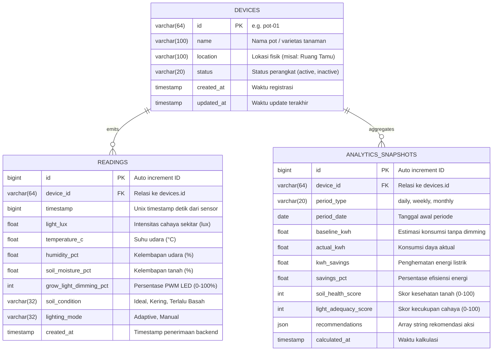

# Desain Teknis (Technical Design) — Fase 1: Database Schema & Migration

Dokumen ini mendefinisikan Entity Relationship Diagram (ERD), skema DDL MariaDB, strategi indeks kueri time-series, implementasi tool migrasi, serta data awal (*seed data*).

---

## 1. Entity Relationship Diagram (ERD)



---

## 2. Definisi Skema DDL SQL

### 2.1 Tabel `devices`
```sql
CREATE TABLE IF NOT EXISTS devices (
    id VARCHAR(64) NOT NULL PRIMARY KEY,
    name VARCHAR(100) NOT NULL,
    location VARCHAR(100) DEFAULT 'Indoor',
    status VARCHAR(20) NOT NULL DEFAULT 'active',
    created_at TIMESTAMP NOT NULL DEFAULT CURRENT_TIMESTAMP,
    updated_at TIMESTAMP NOT NULL DEFAULT CURRENT_TIMESTAMP ON UPDATE CURRENT_TIMESTAMP
) ENGINE=InnoDB DEFAULT CHARSET=utf8mb4 COLLATE=utf8mb4_unicode_ci;
```

### 2.2 Tabel `readings`
```sql
CREATE TABLE IF NOT EXISTS readings (
    id BIGINT NOT NULL AUTO_INCREMENT PRIMARY KEY,
    device_id VARCHAR(64) NOT NULL,
    timestamp BIGINT NOT NULL,
    light_lux FLOAT NOT NULL,
    temperature_c FLOAT NOT NULL,
    humidity_pct FLOAT NOT NULL,
    soil_moisture_pct FLOAT NOT NULL,
    grow_light_dimming_pct INT NOT NULL,
    soil_condition VARCHAR(32) NOT NULL DEFAULT 'Ideal',
    lighting_mode VARCHAR(32) NOT NULL DEFAULT 'Adaptive',
    created_at TIMESTAMP NOT NULL DEFAULT CURRENT_TIMESTAMP,
    CONSTRAINT fk_readings_device FOREIGN KEY (device_id) REFERENCES devices(id) ON DELETE CASCADE,
    INDEX idx_readings_device_timestamp (device_id, timestamp DESC)
) ENGINE=InnoDB DEFAULT CHARSET=utf8mb4 COLLATE=utf8mb4_unicode_ci;
```

### 2.3 Tabel `analytics_snapshots`
```sql
CREATE TABLE IF NOT EXISTS analytics_snapshots (
    id BIGINT NOT NULL AUTO_INCREMENT PRIMARY KEY,
    device_id VARCHAR(64) NOT NULL,
    period_type VARCHAR(20) NOT NULL,
    period_date DATE NOT NULL,
    baseline_kwh FLOAT NOT NULL DEFAULT 0.0,
    actual_kwh FLOAT NOT NULL DEFAULT 0.0,
    kwh_savings FLOAT NOT NULL DEFAULT 0.0,
    savings_pct FLOAT NOT NULL DEFAULT 0.0,
    soil_health_score INT NOT NULL DEFAULT 0,
    light_adequacy_score INT NOT NULL DEFAULT 0,
    recommendations JSON NULL,
    calculated_at TIMESTAMP NOT NULL DEFAULT CURRENT_TIMESTAMP,
    CONSTRAINT fk_analytics_device FOREIGN KEY (device_id) REFERENCES devices(id) ON DELETE CASCADE,
    UNIQUE KEY uq_device_period (device_id, period_type, period_date)
) ENGINE=InnoDB DEFAULT CHARSET=utf8mb4 COLLATE=utf8mb4_unicode_ci;
```

---

## 3. Strategi Indexing & Optimasi Kueri

Kueri analitik dashboard yang paling sering dipanggil adalah:
```sql
SELECT timestamp, light_lux, temperature_c, humidity_pct, soil_moisture_pct, grow_light_dimming_pct
FROM readings
WHERE device_id = ? AND timestamp >= ? AND timestamp <= ?
ORDER BY timestamp DESC
LIMIT ?;
```
Dengan indeks komposit `idx_readings_device_timestamp (device_id, timestamp DESC)`, engine MariaDB akan langsung melakukan *index range scan* terarah tanpa perlu melakukan *sort file buffer* pada baris tabel lain.

---

## 4. Perkakas & Struktur Migrasi Database

Menggunakan perkakas **`golang-migrate/migrate`** yang dapat diintegrasikan sebagai CLI maupun library di dalam kode Go:

```text
backend/
└── migrations/
    ├── 000001_create_devices_table.up.sql
    ├── 000001_create_devices_table.down.sql
    ├── 000002_create_readings_table.up.sql
    ├── 000002_create_readings_table.down.sql
    ├── 000003_create_analytics_snapshots_table.up.sql
    ├── 000003_create_analytics_snapshots_table.down.sql
    └── seeds/
        └── 001_sample_pot_data.sql
```

---

## 5. Trade-Offs & Keputusan Desain

1. **Penyimpanan Unix Timestamp (`BIGINT`) vs `DATETIME(3)`**:
   - *Keputusan*: Disimpan sebagai integer detik `BIGINT` untuk konsistensi mutlak dengan payload NTP dari ESP32 (`1774421526`) dan mempermudah perbandingan matematis rentang waktu tanpa kendala konversi *timezone* database.
2. **Foreign Key Restraints pada High-Throughput Time-Series**:
   - *Keputusan*: Foreign Key tetap dipasang pada tabel `readings` ke `devices` untuk menjaga integritas data pada tahap awal.
   - `TODO: Bila ingest mencapai >100 pot simultan, evaluasi penghapusan constraint FK fisik demi throughput insert dan gantikan dengan soft-validation di layer aplikasi.`
3. **Penyimpanan Rekomendasi sebagai `JSON`**:
   - *Keputusan*: Kolom `recommendations` pada tabel `analytics_snapshots` menggunakan tipe native `JSON` untuk menampung daftar tips dinamis tanpa perlu membuat tabel relasi tersendiri.

---

## 6. Rujukan Dokumen
- [Requirements Fase 1](requirements.md)
- [Techstack Architecture - Section 3 & 4](file:///home/readam/Zaki-Adam/Development/mstr-smart-grow/docs/architecture/Techstack.md#L72-L205)
- [Change Request Log CR-001](file:///home/readam/Zaki-Adam/Development/mstr-smart-grow/docs/change-requests-log.md#L11)
