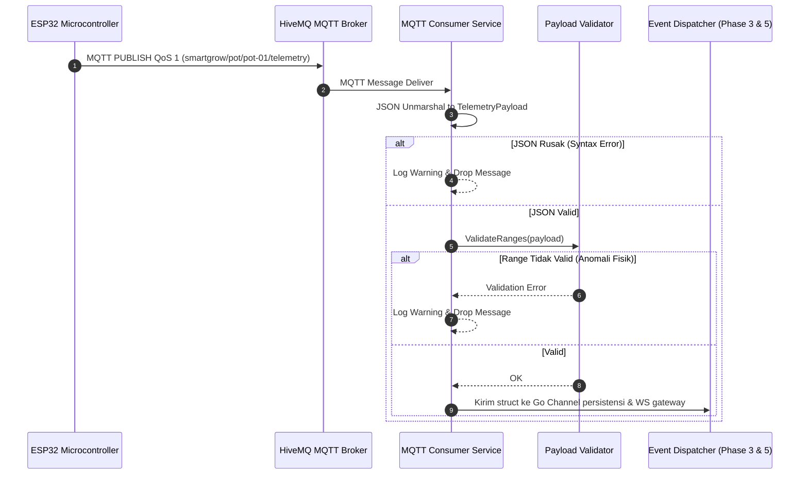
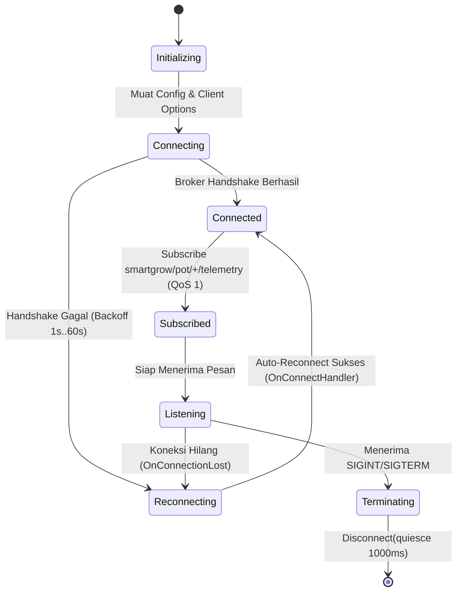

# Desain Teknis (Technical Design) — Fase 2: Backend: MQTT Consumer

Dokumen ini mendefinisikan struktur struct Go untuk payload telemetri, kontrak parser & validator, diagram alur siklus hidup koneksi MQTT, serta strategi penanganan gangguan jaringan (*reconnect strategy*).

---

## 1. Struktur Struct Go Payload Telemetri

Mengacu pada kontrak payload di [Techstack.md Sec 3.2](file:///home/readam/Zaki-Adam/Development/mstr-smart-grow/docs/architecture/Techstack.md#L82-L115):

```go
package mqtt

type SensorData struct {
    LightLux        float64 `json:"light_lux"`
    TemperatureC    float64 `json:"temperature_c"`
    HumidityPct     float64 `json:"humidity_pct"`
    SoilMoisturePct float64 `json:"soil_moisture_pct"`
}

type ActuatorData struct {
    GrowLightDimmingPct int `json:"grow_light_dimming_pct"`
}

type StatusData struct {
    SoilCondition string `json:"soil_condition"`
    LightingMode  string `json:"lighting_mode"`
}

type TelemetryPayload struct {
    DeviceID  string       `json:"device_id"`
    Timestamp int64        `json:"timestamp"`
    Sensors   SensorData   `json:"sensors"`
    Actuators ActuatorData `json:"actuators"`
    Status    StatusData   `json:"status"`
}
```

---

## 2. Diagram Alur Pemrosesan Pesan MQTT



---

## 3. Siklus Hidup Koneksi & Strategi Reconnect



### Konfigurasi Client Paho MQTT:
- `AutoReconnect = true`
- `MaxReconnectInterval = 60 * time.Second`
- `ConnectRetryInterval = 2 * time.Second`
- `CleanSession = false` (untuk mempertahankan status subscription di broker bila didukung)
- `OnConnect = func(client mqtt.Client)`: Mendaftarkan ulang subscription ke `smartgrow/pot/+/telemetry`.
- `OnConnectionLost = func(client mqtt.Client, err error)`: Mencatat log `WARN` bahwa koneksi terputus.

---

## 4. Aturan Validasi (*Validation Logic*)

Fungsi `Validate(p *TelemetryPayload) error` mengecek:
1. `DeviceID != ""` (panjang 3..64 karakter).
2. `Timestamp > 1577836800` (tidak boleh lebih lama dari 1 Jan 2020) dan `Timestamp <= time.Now().Unix() + 300` (toleransi *clock drift* ESP32 maksimal 5 menit ke masa depan).
3. `LightLux >= 0 && LightLux <= 150000`.
4. `TemperatureC >= -20.0 && TemperatureC <= 85.0`.
5. `HumidityPct >= 0.0 && HumidityPct <= 100.0`.
6. `SoilMoisturePct >= 0.0 && SoilMoisturePct <= 100.0`.
7. `GrowLightDimmingPct >= 0 && GrowLightDimmingPct <= 100`.

---

## 5. Trade-Offs & Keputusan Desain

1. **Pengambilan Device ID (Topic Token vs JSON Body)**:
   - *Keputusan*: Backend memprioritaskan `device_id` di dalam JSON payload. Apabila field tersebut kosong, fallback mengambil token kedua dari topik (`smartgrow/pot/{pot_id}/telemetry`).
2. **QoS 1 vs QoS 0**:
   - *Keputusan*: QoS 1 dipilih sesuai spesifikasi [Techstack.md](file:///home/readam/Zaki-Adam/Development/mstr-smart-grow/docs/architecture/Techstack.md#L80) untuk memastikan telemetri penting (termasuk status hidrasi tanah) tidak hilang di jaringan Wi-Fi rumah yang fluktuatif.
3. **Penanganan Pesan Duplikat (QoS 1 At-Least-Once)**:
   - *Keputusan*: Ditoleransi di layer consumer. Filter idempotensi akan ditangani di layer persistensi MariaDB (Fase 3) menggunakan indeks timestamp.

---

## 6. Rujukan Dokumen
- [Requirements Fase 2](requirements.md)
- [Techstack Architecture - MQTT Payload Spec](file:///home/readam/Zaki-Adam/Development/mstr-smart-grow/docs/architecture/Techstack.md#L72-L115)
- [Design Fase 1 - Skema Tabel Readings](../01-database-schema-migration/design.md#22-tabel-readings)
