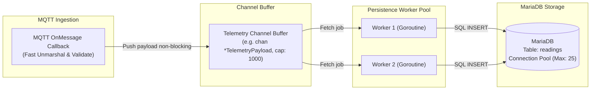
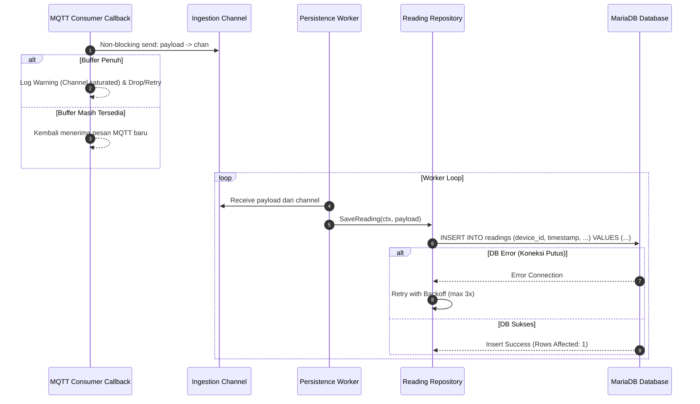

# Desain Teknis (Technical Design) — Fase 3: Backend: Persistence Layer

Dokumen ini mendefinisikan arsitektur pipeline penulisan data asinkron (*asynchronous persistence pipeline*), antarmuka Go Repository/DAO, strategi buffering channel, serta analisis trade-off antara *direct insert* dan *batch buffering*.

---

## 1. Arsitektur Asynchronous Pipeline & Worker Pool

Pemisahan antara callback MQTT dan penulisan database dilakukan melalui Go channel berpenyangga (*buffered channel*) dan *worker goroutines*:



---

## 2. Sequence Diagram: Ingestion hingga Persistensi



---

## 3. Kontrak Go Repository Interface

Definisi interface repository pada package `internal/repository`:

```go
package repository

import (
    "context"
    "github.com/mstr-smart-grow/backend/internal/mqtt"
)

type ReadingRecord struct {
    ID                  int64   `db:"id"`
    DeviceID            string  `db:"device_id"`
    Timestamp           int64   `db:"timestamp"`
    LightLux            float64 `db:"light_lux"`
    TemperatureC        float64 `db:"temperature_c"`
    HumidityPct         float64 `db:"humidity_pct"`
    SoilMoisturePct     float64 `db:"soil_moisture_pct"`
    GrowLightDimmingPct int     `db:"grow_light_dimming_pct"`
    SoilCondition       string  `db:"soil_condition"`
    LightingMode        string  `db:"lighting_mode"`
    CreatedAt           string  `db:"created_at"`
}

type ReadingRepository interface {
    // SaveReading menyimpan rekaman telemetri tunggal ke MariaDB
    SaveReading(ctx context.Context, payload *mqtt.TelemetryPayload) error
    
    // SaveBatchReadings menyimpan kumpulan rekaman dalam satu transaksi / multi-row insert
    SaveBatchReadings(ctx context.Context, payloads []*mqtt.TelemetryPayload) error

    // GetLatestReading mengambil data pembacaan paling akhir dari suatu pot
    GetLatestReading(ctx context.Context, deviceID string) (*ReadingRecord, error)

    // GetHistoricalReadings mengambil data historis berdasarkan rentang Unix timestamp
    GetHistoricalReadings(ctx context.Context, deviceID string, fromTs, toTs int64, limit int) ([]*ReadingRecord, error)
}
```

---

## 4. Analisis Strategi Buffering & Batching

Terdapat dua pendekatan penulisan database:

| Karakteristik | Opsi A: Direct Insert per Pesan | Opsi B: Micro-Batching (Buffer & Bulk Insert) |
| :--- | :--- | :--- |
| **Mekanisme** | Setiap pesan dari channel langsung dieksekusi `INSERT INTO readings ...`. | Pesan dikumpulkan di slice buffer memori hingga mencapai *N* item (mis. 50) atau timeout *T* (mis. 2s), lalu dieksekusi `INSERT INTO readings (...) VALUES (...), (...)`. |
| **Throughput** | Cukup untuk skala 1–10 pot (~2 pesan/detik). | Sangat tinggi, mampu melayani ratusan pot tanpa membebani disk I/O database. |
| **Latensi Persistensi** | Sangat rendah (data langsung tersimpan < 20ms). | Terdapat delay buffer sebesar jendela timeout *T*. |
| **Kompleksitas** | Rendah, penanganan rollback error sederhana. | Lebih tinggi, membutuhkan flush timer dan penanganan partial error. |

### Keputusan Awal & TODO Tim:
- **Keputusan**: Pada rilis awal (1–5 pot prototype), gunakan **Opsi A (Direct Insert dengan Worker Pool non-blocking)** untuk menjaga kode tetap sederhana dan latensi instan.
- `TODO: Tentukan ambang batas pengaktifan Opsi B (Micro-Batching). Pertanyaan spesifik untuk tim: Apakah volume pot akan melampaui 20 unit dalam fase uji coba lapangan sehingga butuh bulk insert sekarang, atau cukup dipicu setelah metrik latency insert MariaDB melampaui 100ms?`

---

## 5. Rujukan Dokumen
- [Requirements Fase 3](requirements.md)
- [Design Fase 1 - Skema Tabel Readings](../01-database-schema-migration/design.md#22-tabel-readings)
- [Design Fase 2 - Struct TelemetryPayload](../02-backend-mqtt-consumer/design.md#1-struktur-struct-go-payload-telemetri)
