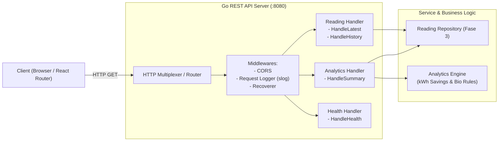

# Desain Teknis (Technical Design) — Fase 4: Backend: REST API

Dokumen ini mendefinisikan spesifikasi kontrak REST API, skema respon JSON terpadu, algoritma kalkulasi penghematan energi (kWh), serta strategi pengujian integrasi API.

---

## 1. Arsitektur Handler & Routing HTTP

Routing HTTP dibangun menggunakan modul standard library Go `net/http` (Go 1.22+ routing dengan method matching) atau router ringan:



---

## 2. Spesifikasi Endpoint & Kontrak Respon

Seluruh format respon mengacu pada [Techstack.md Sec 4.1](file:///home/readam/Zaki-Adam/Development/mstr-smart-grow/docs/architecture/Techstack.md#L120-L205).

### 2.1 Standard Error Response
Semua error dari endpoint mengembalikan struktur seragam:
```json
{
  "error": {
    "code": "DEVICE_NOT_FOUND",
    "message": "Perangkat dengan ID 'pot-99' tidak ditemukan atau belum aktif.",
    "details": null
  }
}
```

### 2.2 Endpoint Detail

#### a. `GET /api/readings/latest`
- **Query Params**: `device_id` (opsional, string).
- **Status 200 OK**:
  ```json
  {
    "device_id": "pot-01",
    "timestamp": 1774421526,
    "light_lux": 420.5,
    "temperature_c": 27.2,
    "humidity_pct": 65.0,
    "soil_moisture_pct": 48.0,
    "grow_light_dimming_pct": 35,
    "soil_condition": "Ideal"
  }
  ```

#### b. `GET /api/readings`
- **Query Params**:
  - `device_id` (wajib, string)
  - `range` (opsional: `1h`, `6h`, `24h`, `7d`, `30d`; default: `24h`)
  - `limit` (opsional: integer 1..1000; default: 100)
- **Status 200 OK**:
  ```json
  {
    "device_id": "pot-01",
    "range": "24h",
    "count": 2,
    "data": [
      {
        "timestamp": 1774417926,
        "light_lux": 300.0,
        "temperature_c": 26.8,
        "humidity_pct": 67.0,
        "soil_moisture_pct": 49.5,
        "grow_light_dimming_pct": 50
      }
    ]
  }
  ```

#### c. `GET /api/analytics/summary`
- **Query Params**:
  - `device_id` (wajib, string)
  - `period` (opsional: `today`, `this_week`, `this_month`; default: `today`)
- **Status 200 OK**:
  ```json
  {
    "device_id": "pot-01",
    "period": "today",
    "energy_metrics": {
      "baseline_consumption_kwh": 0.480,
      "actual_consumption_kwh": 0.285,
      "kwh_savings": 0.195,
      "energy_savings_pct": 40.6
    },
    "biological_insight": {
      "soil_health_score": 92,
      "light_adequacy_score": 96,
      "recommendations": [
        "Kelembapan tanah dalam kondisi optimal. Tidak diperlukan penyiraman dalam 12 jam ke depan.",
        "Pencahayaan alami cukup tinggi siang ini, LED dimmer berhasil memangkas konsumsi daya sebesar ~40%."
      ]
    }
  }
  ```

---

## 3. Rumus & Logika Mesin Analitik (*Analytics Engine*)

### 3.1 Model Konsumsi Daya Listrik (kWh)
- Ditetapkan daya nominal LED grow light (*rated power*) = **15 Watt** (0.015 kW) pada siklus aktif normal 16 jam/hari:
  - **Baseline Consumption (kWh)**:
    $$\text{Baseline kWh} = \frac{P_{\text{nominal}} \times T_{\text{hours}}}{1000} = \frac{15 \times 16}{1000} = 0.240 \text{ kWh (per hari)}$$
  - **Actual Consumption (kWh)**: Dihitung dengan mengintegrasikan rasio dimming dari data sampel:
    $$\text{Actual kWh} = \sum_{i=1}^{N} \left( \frac{P_{\text{nominal}} \times \frac{\text{dimming\_pct}_i}{100} \times \Delta t_i}{1000} \right)$$
  - **kWh Savings**:
    $$\text{kWh Savings} = \text{Baseline kWh} - \text{Actual kWh}$$
  - **Savings Percentage**:
    $$\text{Savings \%} = \left( \frac{\text{kWh Savings}}{\text{Baseline kWh}} \right) \times 100\%$$

### 3.2 Heuristik Penilaian Biologis (Biological Scoring)
- **Soil Health Score (0-100)**: Evaluasi persentase kelembapan tanah terhadap rentang ideal tanaman indoor (40% - 70%). Jika nilai berada dalam rentang ideal, skor = 90-100; jika < 30% atau > 80%, skor mengalami penalti proporsional.
- **Light Adequacy Score (0-100)**: Evaluasi durasi total paparan kombinasi lux alami dan lampu tumbuh terhadap kebutuhan kumulatif harian (DLI - Daily Light Integral).

---

## 4. Trade-Offs & Keputusan Desain

1. **Komputasi Analitik Real-Time vs Pre-Calculated Snapshot**:
   - *Keputusan*: Untuk rentang `today` (hari berjalan), kalkulasi dilakukan secara *on-the-fly* dari agregasi tabel `readings`. Untuk rentang mingguan/bulanan lampau, data dibaca dari tabel `analytics_snapshots` (Fase 1) guna menekan beban kueri SQL.
2. **Framework Web (Standard Lib `net/http` vs Gin/Chi)**:
   - *Keputusan*: Memanfaatkan router baru Go 1.22+ (`http.NewServeMux()` dengan dukungan routing method `GET /api/readings`) untuk meminimalkan ketergantungan pihak ketiga dan menjaga binary tetap ramping.

---

## 5. Rujukan Dokumen
- [Requirements Fase 4](requirements.md)
- [Design Fase 1 - Skema Tabel](../01-database-schema-migration/design.md#2-definisi-skema-ddl-sql)
- [Design Fase 3 - Interface Repository](../03-backend-persistence-layer/design.md#3-kontrak-go-repository-interface)
