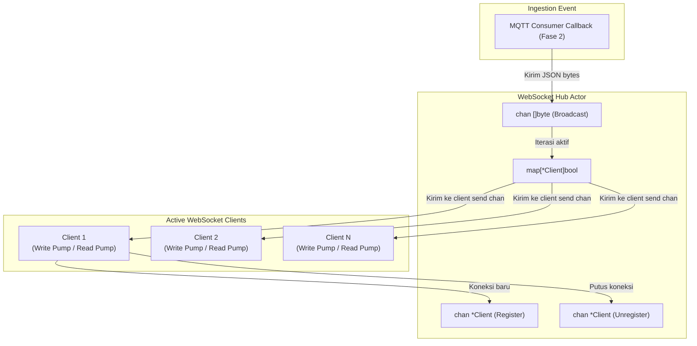
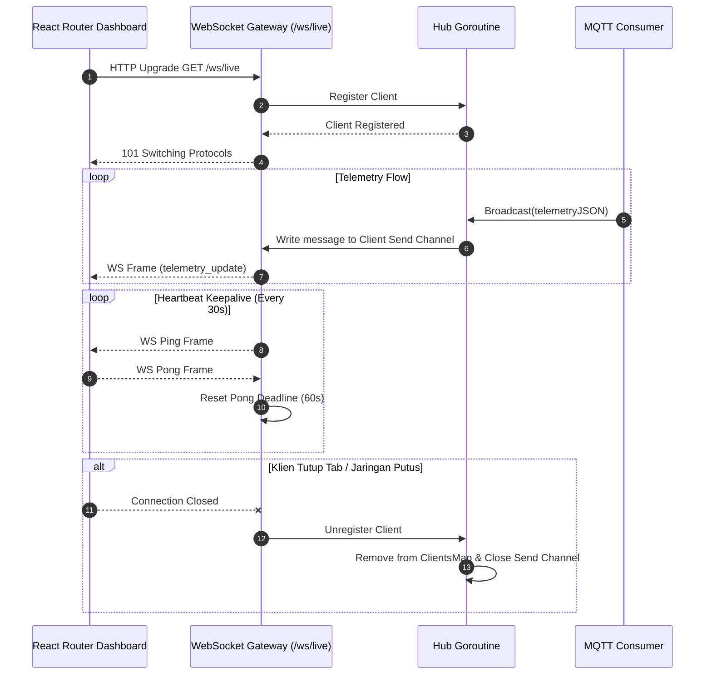

# Desain Teknis (Technical Design) — Fase 5: Backend: WebSocket Gateway

Dokumen ini mendefinisikan arsitektur WebSocket Hub, protokol payload frame, diagram alur penyiaran (*broadcast sequence*), penanganan heartbeat, serta mitigasi klien lambat (*slow consumer*).

---

## 1. Arsitektur WebSocket Hub & Connection Manager

WebSocket Gateway diimplementasikan menggunakan pola Hub terpusat berbasis goroutine dan channels:



---

## 2. Kontrak Frame Pesan WebSocket

Format pesan JSON yang disiarkan mengacu pada [Techstack.md Sec 4.2](file:///home/readam/Zaki-Adam/Development/mstr-smart-grow/docs/architecture/Techstack.md#L217-L237):

```json
{
  "event": "telemetry_update",
  "payload": {
    "device_id": "pot-01",
    "timestamp": 1774421526,
    "sensors": {
      "light_lux": 420.5,
      "temperature_c": 27.2,
      "humidity_pct": 65.0,
      "soil_moisture_pct": 48.0
    },
    "actuators": {
      "grow_light_dimming_pct": 35
    },
    "status": {
      "soil_condition": "Ideal",
      "lighting_mode": "Adaptive"
    }
  }
}
```

---

## 3. Sequence Diagram: Broadcast & Heartbeat



---

## 4. Penanganan Klien Lambat (*Slow Consumer Mitigation*)

Setiap klien memiliki saluran pengiriman berpenyangga (*send buffer*, misal `send chan []byte` dengan kapasitas 256 pesan).
- Jika goroutine `writePump` klien tidak mampu mengirimkan pesan ke soket jaringan dan antrean `send` penuh (*buffer full*), Hub menganggap koneksi klien tersebut macet.
- Hub akan segera menutup saluran, mencopot registrasi klien, dan membebaskan sumber daya memori tanpa memengaruhi koneksi klien lainnya (*fail-isolated*).

---

## 5. Trade-Offs & Keputusan Desain

1. **Pustaka WebSocket (`nhooyr.io/websocket` vs `gorilla/websocket`)**:
   - *Keputusan*: Menggunakan `github.com/gorilla/websocket` (standar industri paling banyak diuji) atau standard idiomatic Go `coder/websocket` (fork modern dari nhooyr). Keduanya mendukung streaming berbasis konteks dan zero-allocation ping/pong.
2. **Topik Filtering sisi Klien vs Server**:
   - *Keputusan*: Pada tahap awal dengan skala 1–5 pot, server menyiarkan seluruh telemetri ke semua klien yang terhubung (`/ws/live`). Pemfilteran data spesifik pot dilakukan pada state frontend berdasarkan `device_id`.
   - `TODO: Jika jumlah pot bertambah signifikan, implementasikan query parameter pada koneksi WS (misal /ws/live?device_id=pot-01) atau frame subscribe berbasis teks agar server hanya menyiarkan pot yang diminta.`

---

## 6. Rujukan Dokumen
- [Requirements Fase 5](requirements.md)
- [Design Fase 2 - Payload Struct](../02-backend-mqtt-consumer/design.md#1-struktur-struct-go-payload-telemetri)
- [Techstack Architecture - WebSocket Specification](file:///home/readam/Zaki-Adam/Development/mstr-smart-grow/docs/architecture/Techstack.md#L208-L238)
