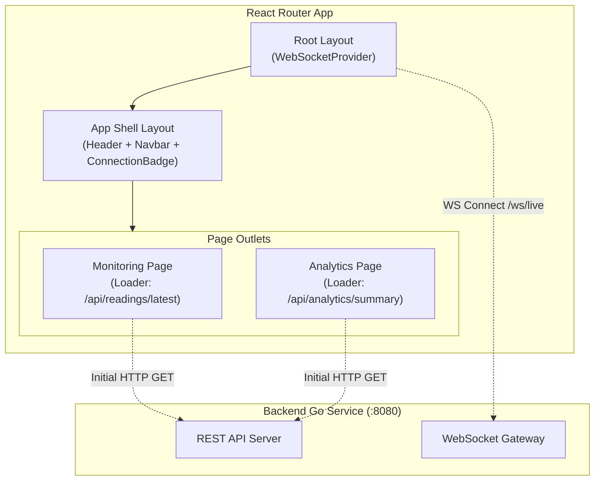
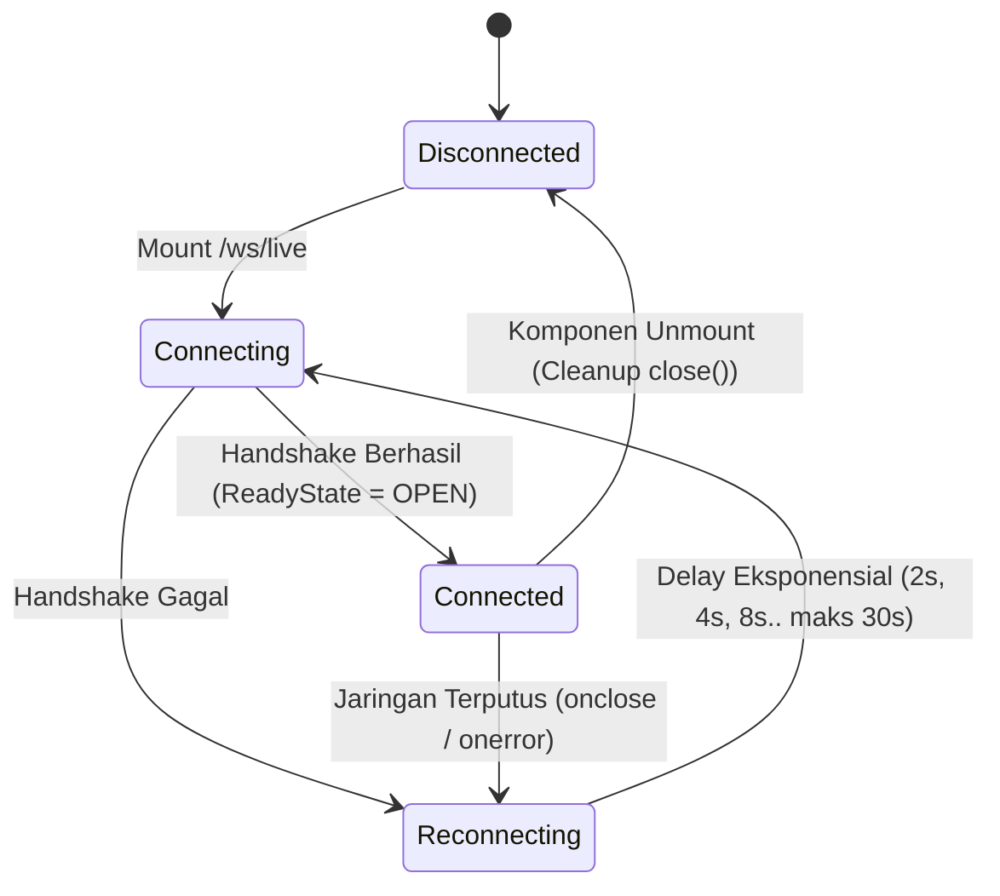

# Desain Teknis (Technical Design) — Fase 6: Frontend: Dashboard Skeleton (React Router)

Dokumen ini mendefinisikan struktur routing React Router, hierarki pohon komponen (*component tree*), arsitektur context WebSocket provider, diagram transisi status konektivitas, serta tata letak antarmuka aplikasi.

---

## 1. Struktur Rute Aplikasi (React Router)

Aplikasi mengadopsi arsitektur routing deklaratif React Router:

```text
/ (Index)                 --> Redirect to /monitoring
/monitoring               --> Halaman Live Monitoring (Fase 7)
/analytics                --> Halaman Historical & Energy Insights (Fase 8)
/settings                 --> Halaman Metadata Pot / Pengaturan Sistem (Opsional)
```

### Pohon Rute & File Layout:
```text
frontend/app/
├── root.tsx                  # Root layout, meta tags, script inject
├── routes/
│   ├── _layout.tsx           # App Shell: Navbar, Header, Status Indicator, Outlet
│   ├── index.tsx             # Redirect loader to /monitoring
│   ├── monitoring.tsx        # Route page: loader fetch /api/readings/latest
│   └── analytics.tsx         # Route page: loader fetch /api/analytics/summary
├── components/
│   ├── layout/
│   │   ├── Navbar.tsx        # Navigasi rute & logo
│   │   ├── Header.tsx        # Pot selector dropdown & connection pill
│   │   └── ConnectionBadge.tsx # Visualisasi status WS
│   └── common/
│       ├── ErrorBoundary.tsx # Tampilan error fallback
│       └── LoadingSpinner.tsx
├── context/
│   └── WebSocketContext.tsx  # Global WebSocket Provider & Event Emitter
├── hooks/
│   └── useWebSocket.ts       # Hook konsumsi status koneksi & incoming telemetry
└── services/
    └── api.ts                # Wrapper fetch HTTP untuk endpoint backend
```

---

## 2. Arsitektur Data Flow & Pohon Komponen



---

## 3. Desain Klien WebSocket & Mesin Status Koneksi



### Interface Hook `useWebSocket`:
```typescript
export type ConnectionStatus = 'connecting' | 'connected' | 'disconnected' | 'reconnecting';

export interface TelemetryEvent {
  device_id: string;
  timestamp: number;
  sensors: {
    light_lux: number;
    temperature_c: number;
    humidity_pct: number;
    soil_moisture_pct: number;
  };
  actuators: {
    grow_light_dimming_pct: number;
  };
  status: {
    soil_condition: string;
    lighting_mode: string;
  };
}

export interface WebSocketContextValue {
  status: ConnectionStatus;
  lastTelemetry: TelemetryEvent | null;
  sendMessage: (msg: unknown) => void;
}
```

---

## 4. Layout Wireframe Konseptual

```text
+-------------------------------------------------------------------------+
| [Logo] Smart Grow Pot        [ Pot: Monstera #1 (pot-01) v ]  [● Connected] |
+-------------------------------------------------------------------------+
| [Nav: Live Monitoring]  |  [Nav: Historical Analytics]  | [Nav: Settings] |
+-------------------------------------------------------------------------+
|                                                                         |
|                     < Outlet: Konten Halaman Aktif >                     |
|                                                                         |
+-------------------------------------------------------------------------+
```

---

## 5. Trade-Offs & Keputusan Desain

1. **State Management (Redux/Zustand vs React Context)**:
   - *Keputusan*: Memanfaatkan React Context bawaan dikombinasikan dengan custom hook untuk data WebSocket dan loader React Router untuk data server. Pendekatan ini menghindari *boilerplate* pustaka eksternal yang berlebihan pada tahap awal.
2. **Koneksi WebSocket Tunggal vs Per-Halaman**:
   - *Keputusan*: Koneksi WebSocket diinisialisasi pada level *Root Layout* (`WebSocketProvider`) sehingga koneksi soket tetap bertahan (*persistent*) saat pengguna berpindah antar halaman navigasi tanpa re-handshake.

---

## 6. Rujukan Dokumen
- [Requirements Fase 6](requirements.md)
- [Design Fase 4 - Kontrak REST API](../04-backend-rest-api/design.md#2-spesifikasi-endpoint--kontrak-respon)
- [Design Fase 5 - WebSocket Protocol](../05-backend-websocket-gateway/design.md#2-kontrak-frame-pesan-websocket)
