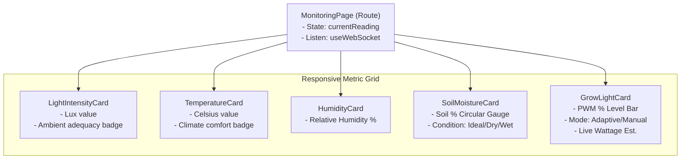
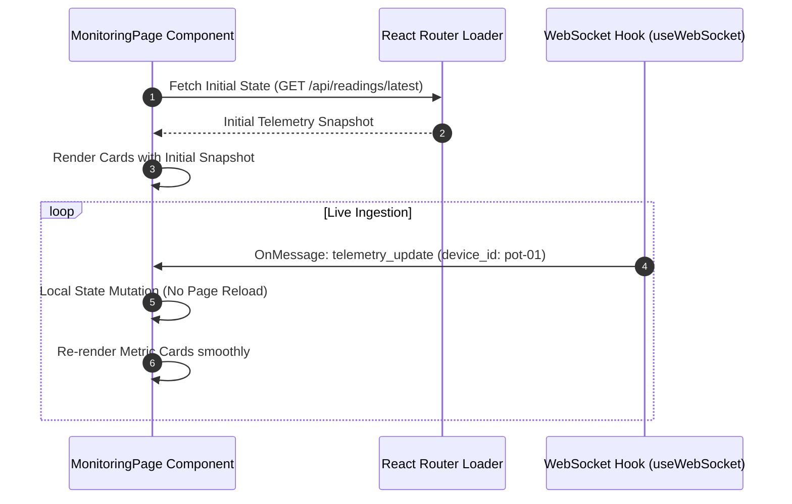

# Desain Teknis (Technical Design) — Fase 7: Frontend: Real-time Monitoring View

Dokumen ini mendefinisikan rancangan komponen antarmuka pemantauan langsung (*Live Monitoring View*), strategi sinkronisasi state antara initial REST loader dan aliran WebSocket, penanganan deteksi data usang (*stale data*), serta tata letak visual (*wireframe*).

---

## 1. Arsitektur Komponen Live Monitoring

Komponen dipecah secara modular untuk mengisolasi render:



---

## 2. Sinkronisasi State: REST Initial Loader vs WebSocket Live Feed

Untuk menjamin antarmuka instan tanpa jeda:
1. Saat halaman pertama kali dimuat, data diperoleh dari **React Router Loader** (`GET /api/readings/latest`). State awal diinisialisasi dengan data ini.
2. Hook `useWebSocket` mendengarkan event `telemetry_update`.
3. Bila ada event masuk dan `payload.device_id === activeDeviceId`, hook menjalankan fungsi updater state fungsional:
   ```typescript
   setReading((prev) => ({
     ...prev,
     ...payload.sensors,
     ...payload.actuators,
     ...payload.status,
     timestamp: payload.timestamp,
     lastReceivedAt: Date.now(),
   }));
   ```



---

## 3. Deteksi Data Usang (*Stale Data Watchdog*)

Sebuah hook watchdog `useStaleData(lastTimestamp, timeoutMs = 30000)` dijalankan dengan interval timer setiap 5 detik:
- Jika `(Date.now() / 1000) - currentReading.timestamp > 30`, status ditandai sebagai `isStale = true`.
- Tampilan kartu akan menampilkan overlay atau badge kuning bertuliskan *"Perangkat Tidak Merespons (>30s)"*.

---

## 4. Tata Letak Wireframe Visual (Dashboard Grid)

```text
+-----------------------------------------------------------------------------------+
| Ringkasan Pemantauan: Pot Monstera Deliciosa (pot-01)        [Status: Live / 2s lalu] |
+-----------------------------------------------------------------------------------+
|  [ KARTU 1: CAHAYA ]        |  [ KARTU 2: SUHU UDARA ]   |  [ KARTU 3: KELEMBAPAN ]  |
|  Nilai: 420.5 Lux           |  Nilai: 27.2 °C            |  Nilai: 65.0 %            |
|  Status: Cukup Terang       |  Status: Hangat Nyaman     |  Status: Optimal          |
+-----------------------------------------------------------------------------------+
|  [ KARTU 4: KELEMBAPAN TANAH ]              |  [ KARTU 5: GROW LIGHT ADAPTIF ]     |
|  Nilai: 48.0 %                              |  Dimming PWM: 35 %                   |
|  Indikator: [=====O=====]                   |  Indikator Daya: [===-------]        |
|  Kondisi: IDEAL (Tidak perlu siram)         |  Mode: ADAPTIVE (Hemat ~65% Daya)    |
+-----------------------------------------------------------------------------------+
```

---

## 5. Trade-Offs & Keputusan Desain

1. **Circular Gauge vs Simple Numeric Card**:
   - *Keputusan*: Menggunakan kombinasi SVG Gauge ringan untuk kelembapan tanah dan kartu numerik bersih dengan progress bar untuk cahaya & peredupan guna menghemat ukuran bundel JavaScript tanpa ketergantungan library grafik berat di halaman live view.
2. **Re-render Granularity**:
   - *Keputusan*: Setiap kartu metrik dibungkus dengan `React.memo` dengan perbandingan nilai primitif agar jika hanya nilai lux yang berfluktuasi, kartu kelembapan tanah tidak melakukan render ulang (*re-render bypass*).

---

## 6. Rujukan Dokumen
- [Requirements Fase 7](requirements.md)
- [Design Fase 5 - WebSocket Protocol](../05-backend-websocket-gateway/design.md#2-kontrak-frame-pesan-websocket)
- [Design Fase 6 - Component Tree](../06-frontend-dashboard-skeleton/design.md#2-arsitektur-data-flow--pohon-komponen)
