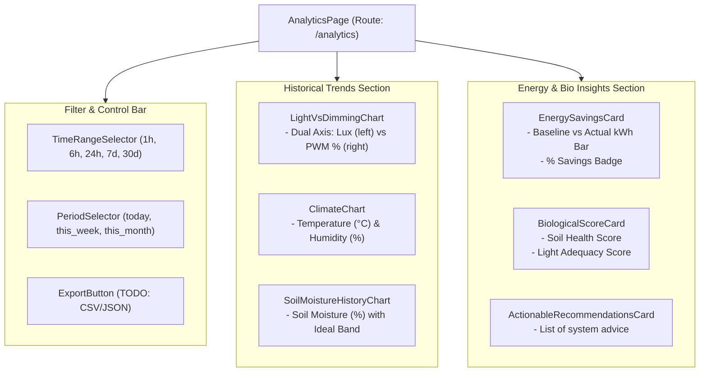
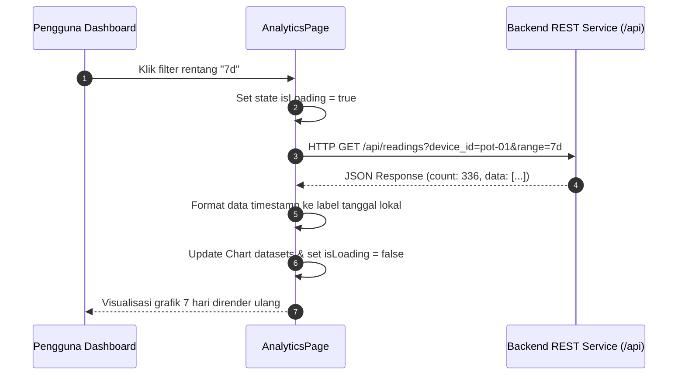

# Desain Teknis (Technical Design) — Fase 8: Frontend: Analytics & Historical View

Dokumen ini mendefinisikan rancangan antarmuka visualisasi historis, arsitektur pemanggilan data kueri rentang waktu, evaluasi library grafik, metrik panel energi, serta wireframe tampilan.

---

## 1. Arsitektur Komponen Analytics & Historical



---

## 2. Alur Interaksi Data & Pembaruan Rentang Waktu



---

## 3. Evaluasi Library Grafik & Keputusan Desain

| Kriteria | Recharts | Chart.js (react-chartjs-2) | Apache ECharts |
| :--- | :--- | :--- | :--- |
| **Integrasi React** | Sangat native (berbasis komponen deklaratif & SVG). | Wrapper di atas canvas DOM imperatif. | Wrapper di atas canvas imperatif. |
| **Ukuran Bundel** | Sedang (~45 KB gzipped). | Ringan (~35 KB gzipped). | Berat (~150 KB+ gzipped). |
| **Kustomisasi Tema** | Sangat mudah dikontrol via CSS & props SVG. | Memerlukan opsi konfigurasi objek kompleks. | Opsi objek sangat ekstensif dan kompleks. |
| **Dual-Axis Support** | Tersedia *out-of-the-box* (`<YAxis yAxisId="left" />`). | Didukung. | Didukung. |

### Keputusan & TODO Tim:
- **Rekomendasi**: Mengadopsi **Recharts** untuk kenyamanan pengembangan berbasis komponen React yang deklaratif dan tampilan yang tajam pada layar resolusi tinggi (Retina/SVG).
- `TODO: Tentukan chart library final. Pertanyaan untuk tim: Apakah Recharts disetujui sebagai standar resmi visualisasi grafik frontend, atau ada preferensi ke Chart.js demi ukuran bundel yang sedikit lebih kecil?`

---

## 4. Fitur Ekspor Data (TODO)

- `TODO: Tentukan format ekspor data historis. Pertanyaan spesifik: Apakah pengguna memerlukan ekspor langsung ke format CSV (Comma Separated Values) untuk dibuka di Excel/Spreadsheet, atau cukup unduh dump JSON mentah?`

---

## 5. Tata Letak Wireframe Visual (Analytics View)

```text
+-----------------------------------------------------------------------------------+
| Ringkasan Analitik Pot: Monstera Deliciosa (pot-01)                                |
| Filter Rentang: [ 1 Jam | 6 Jam | [24 Jam] | 7 Hari | 30 Hari ]    [📥 Unduh CSV]  |
+-----------------------------------------------------------------------------------+
| [GRAFIK 1: INTENSITAS CAHAYA (LUX) VS PEREDUPAN LAMPU (PWM %)]                    |
| 1000 lx |      /\                                    | 100% PWM                   |
|  500 lx | ____/  \____  (Lux)                        |  50% PWM                   |
|    0 lx | ------------\_____________________________ |   0% PWM (Lampu Meredup)   |
|         00:00   04:00   08:00   12:00   16:00   20:00                             |
+-----------------------------------------------------------------------------------+
| [GRAFIK 2: SUHU & KELEMBAPAN UDARA]    | [GRAFIK 3: TREN KELEMBAPAN TANAH]         |
+-----------------------------------------------------------------------------------+
| [PANEL METRIK ENERGI LISTRIK]          | [SKOR & REKOMENDASI BIOLOGIS]             |
| Periode: [Hari Ini v]                  | Skor Tanah: [ 92 / 100 ] (Kondisi Bagus)  |
| Baseline Daya : 0.480 kWh              | Skor Cahaya: [ 96 / 100 ] (Sangat Cukup)  |
| Daya Aktual   : 0.285 kWh              | Rekomendasi:                              |
| Energi Hemat  : 0.195 kWh (40.6%)      | • Kelembapan optimal, tunda penyiraman.   |
| Status Efisiensi: [ SANGAT EFISIEN ]   | • Sensor lux berfungsi sempurna.          |
+-----------------------------------------------------------------------------------+
```

---

## 6. Rujukan Dokumen
- [Requirements Fase 8](requirements.md)
- [Design Fase 4 - Kontrak REST API](../04-backend-rest-api/design.md#2-spesifikasi-endpoint--kontrak-respon)
- [Techstack Architecture - Matriks Tech Stack](file:///home/readam/Zaki-Adam/Development/mstr-smart-grow/docs/architecture/Techstack.md#L7-L18)
