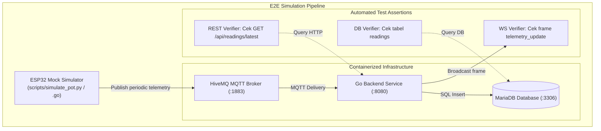

# Desain Teknis (Technical Design) — Fase 9: Integration Testing & Deployment

Dokumen ini mendefinisikan arsitektur pengujian integrasi ujung-ke-ujung (*End-to-End Simulation*), desain kontainer Docker produksi multi-stage, konfigurasi server web frontend, strategi pencatatan log terstruktur (*structured logging*), serta analisis opsi deployment cloud.

---

## 1. Arsitektur Pengujian Integrasi End-to-End

Simulator bertindak menggantikan node fisik ESP32 untuk memvalidasi seluruh rangkaian sistem data secara otomatis:



---

## 2. Kontainerisasi Produksi (Docker Multi-Stage Build)

### 2.1 Backend `backend/Dockerfile`
```dockerfile
# Stage 1: Build binary statis
FROM golang:1.22-alpine AS builder
WORKDIR /app
RUN apk add --no-cache ca-certificates git
COPY go.mod go.sum ./
RUN go mod download
COPY . .
RUN CGO_ENABLED=0 GOOS=linux GOARCH=amd64 go build -ldflags="-w -s" -o smartgrow-backend ./cmd/server/main.go

# Stage 2: Final runtime image minimal
FROM alpine:3.20
RUN adduser -D -u 10001 appuser
WORKDIR /app
COPY --from=builder /app/smartgrow-backend .
COPY --from=builder /etc/ssl/certs/ca-certificates.crt /etc/ssl/certs/
USER appuser
EXPOSE 8080
ENTRYPOINT ["./smartgrow-backend"]
```

### 2.2 Frontend `frontend/Dockerfile`
```dockerfile
# Stage 1: Build client bundles
FROM node:20-alpine AS builder
WORKDIR /app
COPY package*.json ./
RUN npm ci
COPY . .
RUN npm run build

# Stage 2: Web Server Nginx Alpine
FROM nginx:alpine-slim
COPY --from=builder /app/build/client /usr/share/nginx/html
COPY nginx.conf /etc/nginx/conf.d/default.conf
EXPOSE 80
CMD ["nginx", "-g", "daemon off;"]
```

---

## 3. Strategi Logging & Monitoring

- **Structured Logging (`log/slog`)**:
  Semua log backend ditulis dalam format JSON ke `stdout` dengan skema terstruktur:
  ```json
  {
    "time": "2026-09-26T15:00:00Z",
    "level": "INFO",
    "msg": "telemetry record persisted",
    "device_id": "pot-01",
    "latency_ms": 14.2
  }
  ```
- **Health Probes**:
  Pemeriksaan *Readiness* dan *Liveness* mengarah ke `GET /api/health` yang menguji koneksi broker dan database secara berkala.

---

## 4. Opsi Deployment & TODO Tim

| Target Deployment | Kelebihan | Kekurangan |
| :--- | :--- | :--- |
| **Opsi A: VPS Standar (Docker Compose)** | Murah, konfigurasi seragam dengan lingkungan lokal, kendali penuh atas jaringan MariaDB & MQTT. | Perlu konfigurasi manual untuk SSL (Certbot) dan backup database. |
| **Opsi B: Managed PaaS (Fly.io / Render)** | Otomatisasi deployment dari git, zero-ops untuk sertifikat HTTPS dan scaling. | Biaya MariaDB managed lebih mahal, koneksi MQTT eksternal perlu port routing khusus. |
| **Opsi C: Cloud Managed (AWS / GCP)** | Skalabilitas tanpa batas, integrasi dengan cloud IoT (AWS IoT Core / GCP IoT). | *Overkill* dan kompleksitas arsitektur terlalu tinggi untuk prototipe awal. |

### Keputusan Awal & TODO Tim:
- **Rekomendasi**: Menggunakan **Opsi A (Docker Compose pada VPS seperti DigitalOcean/Hetzner)** untuk menyatukan Go backend, Nginx frontend, dan MariaDB dengan biaya ekonomis.
- `TODO: Tentukan cloud host / target deployment akhir. Pertanyaan untuk tim: Apakah rilis v1 akan di-deploy ke VPS tunggal menggunakan docker-compose.prod.yml atau memerlukan deployment terpisah (Frontend di Vercel/Cloudflare Pages dan Backend di PaaS/VPS)?`

---

## 5. Rujukan Dokumen
- [Requirements Fase 9](requirements.md)
- [Design Fase 0 - Docker Stack](../00-project-bootstrap-environment/design.md#3-topologi-lingkungan-lokal-docker-compose)
- [Techstack Architecture - Deployment Matrix](file:///home/readam/Zaki-Adam/Development/mstr-smart-grow/docs/architecture/Techstack.md#L17)
